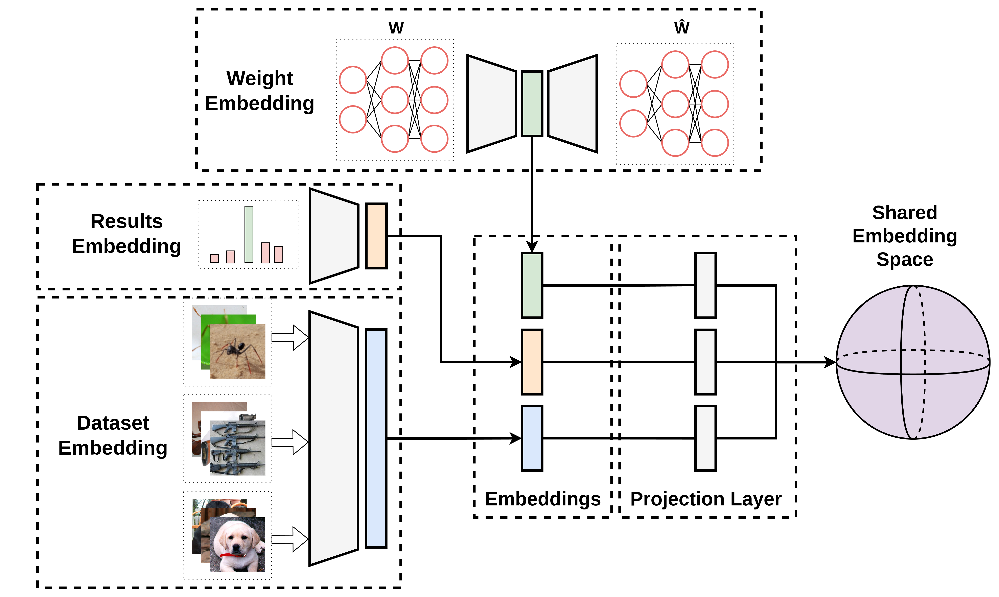

<!-- _class: invert lead -->
# A Contrastive Approach to Weight Space Learning
DJ Swanevelder
Supervised by : Ruan van der Merwe (*Bytefuse*)

---

## Context

  

    <h3>Contrastive Learning</h3>
    <ul>
    <li>Meaningful Representations
    <li>Similiar vs Dissimliar</li>
        <ul>
        <li>NLP → Semantic Relationship (Word2Vec)</li>
        </ul>
    </li>
    </ul>
    <h3>Weight Space</h3>
    <ul>
    <li>Loss Landscape</li>
    <li>1 Datapoint → Full Model</li>
    </ul>
  

  

    <h3>Weight Space Learning</h3>
    <ul>
    <li>Meta-Learning</li>
    <li>Discriminate
        <ul>
        <li>Model Properties</li>
        <li>Performance</li>
        </ul>
    </li>
    <li>Generative
        <ul>
        <li>High-performing Model Weights</li>
        </ul>
    </li>
    </ul>
  

---

## Problem

<!-- - Embedding the weight space
- Embed the dataset/task 
- Embed the corresponding result

Make use of Contrastive learning methods to combine these embeddings into a shared embedding space. Task/Weight/Result space to sample from and generate Weights conditioned on Result/Task/ 

Show the money-shot plot, input result vs output result.  -->