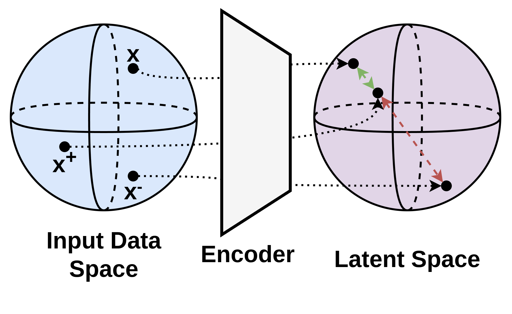
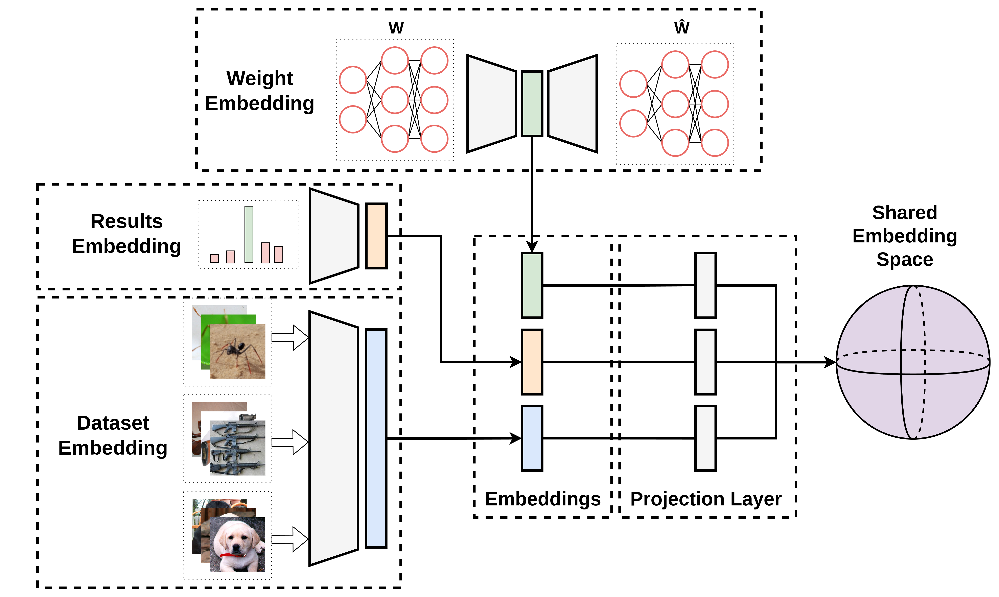
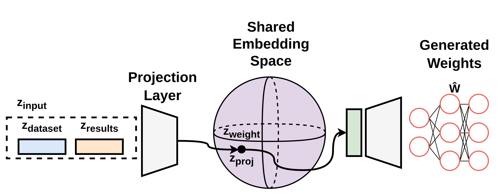
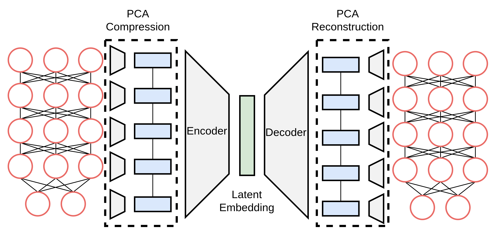
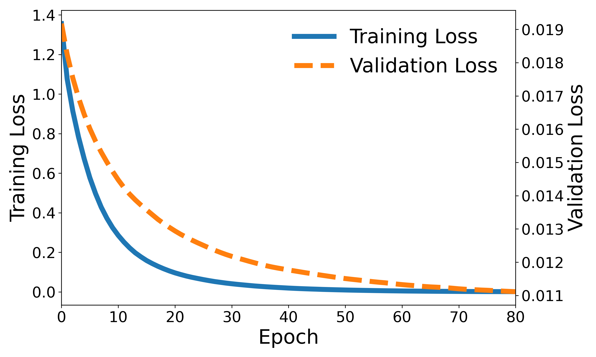
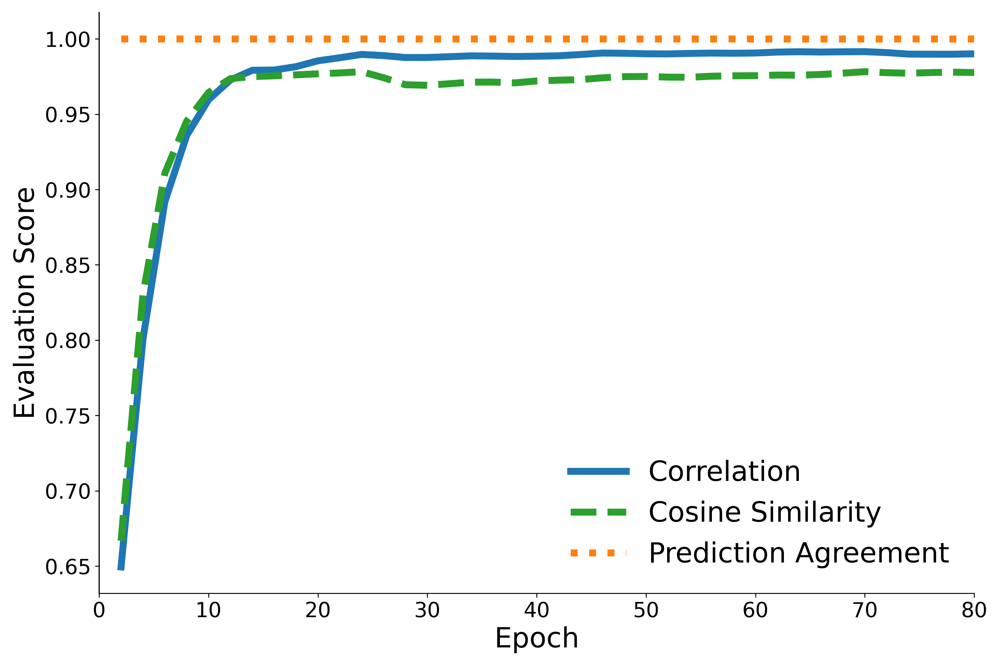
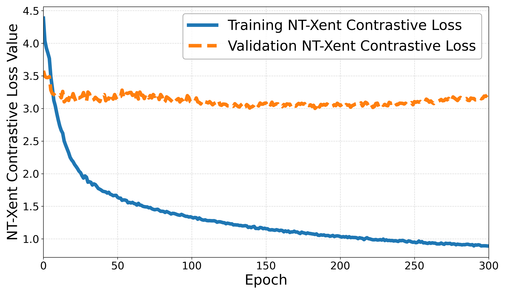
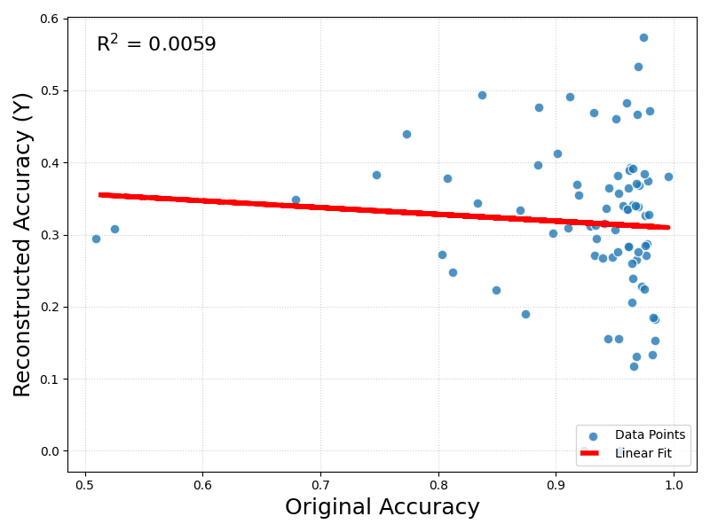

<!-- _class: lead invert -->
# A Contrastive Approach to Weight Space Learning

DJ Swanevelder

Supervised by: Ruan van der Merwe (Bytefuse)

---

## Context

### Contrastive Learning

### Weight Space Learning
- 1 point $\rightarrow$ 1 model
- Discriminative
  - Predict model properties
- Generative
  - High-performing Model Weights

---

## Problem

---
## Conditional Model Sampling

---

## PCA + Weight Autoencoder

---
## Results
### Weight Autoencoder 

  

     
    (a) Loss
  

  

     
    (b) Output Comparison (random input)
  

---

## Results
### Weight Autoencoder

  
Output comparison (real data)

  <table style="margin: 0 auto; width: 200px; font-size: 10px;">
    <thead>
      <tr>
        <th>Metric</th>
        <th>Mean Value</th>
        <th>Range</th>
      </tr>
    </thead>
    <tbody>
      <tr>
        <td>Cosine Similarity</td>
        <td>-0.082</td>
        <td>[−0.547, 0.526]</td>
      </tr>
      <tr>
        <td>Correlation</td>
        <td>0.016</td>
        <td>[−0.329, 0.344]</td>
      </tr>
      <tr>
        <td>Prediction Agreement</td>
        <td>31.21%</td>
        <td>[2.06%, 64.88%]</td>
      </tr>
    </tbody>
  </table>

---
## Results
### Shared Encoder

  

     
    (a) Loss
  

  

     
    (b) Input vs Output Accuracy
  

---
## Conclusion

### Contribution
- First joint modeling of $P(W | D, R)$
- Demonstrates viability of contrastive alignment for heterogeneous modalities

### Future Work 
- Improve weight encoder
  - Reverse PCA
  - PCA + Non-linear Stages
- Sequential Autoencoder for Neural Embeddings
- Dataset distillation 
- Variational Autoencoder 

---
<!-- _class: lead invert -->
# Thank you

---

